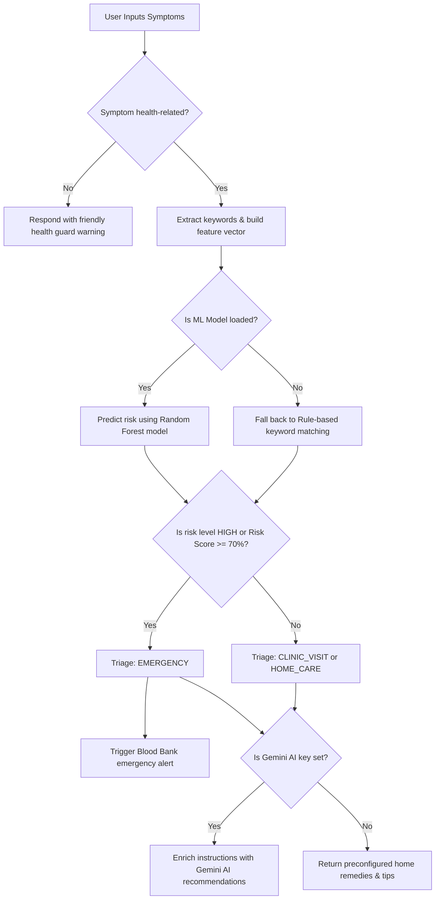

# 📖 MediGuide AI — Architecture, Config, and Local Setup Guide

This guide details how MediGuide AI operates under the hood, how to configure the environment variables in `.env`, and how to build and run the application locally.

---

## 🧠 How the System Works (Architecture Flow)

MediGuide AI is structured as a **Single-Page Application (SPA)** with a Python Flask API serving dynamic JSON response payloads, and MongoDB acting as the primary database store.

### 1. The Request Triage Workflow
When a user describes their symptoms in the chat panel:



- **Health Guard**: First, the backend uses `is_health_related()` in `services/triage_service.py` to filter out non-health questions.
- **Symptom Extraction & ML prediction**: If health-related, it extracts symptoms and creates a feature vector. If the offline ML model (`ml_models/model.pkl`) is loaded successfully at startup, the app predicts risk and maps it using the label encoder (`ml_models/encoder.pkl`).
- **Emergency Alerting**: If triage determines the patient is in an **EMERGENCY** state, the system automatically triggers a blood bank alert:
  - Inserts the emergency record into MongoDB `blood_bank_alerts` collection.
  - Generates console logs tracking the alert.
  - Embeds the alert status in the JSON response to render warning banners on the frontend.
- **AI-Enrichment**: If a `GEMINI_API_KEY` is provided, the backend calls Google's Gemini API (gemini-2.0-flash-lite) to enrich triage advice. Otherwise, it provides traditional home remedies and standard medical guidance offline.

### 2. Database Schema and Roles
The database connection is initiated in `db/mongo.py` using a single global `MongoClient` client instance. It enforces indexes on startup:
* **`users` collection**: Stores names, unique emails, and password hashes using `pbkdf2:sha256` hashing (via Werkzeug security functions).
* **`patients` collection**: Stores consultation records (email, symptoms, risk level, date). Allows tracking history and checks if symptoms recur within 48 hours.
* **`blood_bank_alerts` collection**: Holds all triggered emergency logs, tracking who was alerted, when, and their risk profile.
* **`feedback` collection**: Stores user satisfaction ratings, liked aspects, and suggestions.

---

## ⚙️ Detailed `.env` Configuration

To run the application, copy `.env.example` into a new file named `.env` in the root folder:

```bash
# In the project root directory:
copy .env.example .env
```

Here are the details for each configuration key inside the `.env` file:

| Key | Description | Example / Recommended Value |
|---|---|---|
| **`MONGO_URI`** | The connection string for your MongoDB cluster. For a local instance (`mongod`), use `mongodb://localhost:27017/mediguide`. For Atlas, use `mongodb+srv://...` | `mongodb://localhost:27017/mediguide` (local) or `mongodb+srv://...` (Atlas) |
| **`SECRET_KEY`** | Secret key used by Flask for signing session cookies and CSRF protection. | `secure-random-string-12345` |
| **`GEMINI_API_KEY`** | API key for Google Gemini AI. If empty, the app runs purely offline on rule-based templates. | `AIza...` |
| **`BLOOD_BANK_EMAIL`** | The email address to display as notified when a blood bank alert is triggered. | `bloodbank@hospital.com` |
| **`BLOOD_BANK_PHONE`** | The phone contact to display for emergency alerts. | `+91-9876543210` |
| **`FLASK_ENV`** | Sets debug features. Use `development` locally and `production` when deploying. | `development` |

---

## 💻 Running the Application Locally

Follow these steps to run the complete stack on your local machine:

### Step 1: Set Up Python Virtual Environment
Open your shell (Command Prompt or PowerShell) inside the `health-ai` root directory:
```powershell
# Create virtual environment
python -m venv venv

# Activate the virtual environment
# In Windows PowerShell:
.\venv\Scripts\Activate.ps1
# In Windows Command Prompt:
venv\Scripts\activate
# In macOS/Linux Terminal:
source venv/bin/activate
```

### Step 2: Install Required Dependencies
Install all required packages from the backend directory path:
```powershell
pip install -r backend/requirements.txt
```

### Step 3: Start the Flask Application
Run the entry point script using the path inside `backend/`:
```powershell
python backend/app.py
```

Upon startup, the console will print a confirmation banner containing the local port:
```
[MediGuide] [OK] ML model loaded successfully from ml_models/.
[MediGuide] [WARN] No GEMINI_API_KEY - using rule-based responses.
[MongoDB] [OK] Connected to Atlas - database: mediguide
[MongoDB] [OK] Indexes verified
[MongoDB] [OK] Demo user already exists

==============================================
  [MediGuide AI]  -  Backend  v3.0
==============================================
  ML Model   : [OK] Loaded
  Gemini AI  : [WARN] Set GEMINI_API_KEY
  Blood Bank : bloodbank@hospital.com
  Server     : http://localhost:5000
==============================================

 * Serving Flask app 'app' (lazy loading)
 * Debug mode: on
 * Running on http://127.0.0.1:5000 (Press CTRL+C to quit)
```

### Step 4: Open in Web Browser
Open your browser and navigate to:
👉 **`http://localhost:5000`**

### Step 5: Log In with Demo Account
At the authentication screen, you can use the pre-seeded account:
* **Email**: `demo@mediguide.ai`
* **Password**: `health123`
